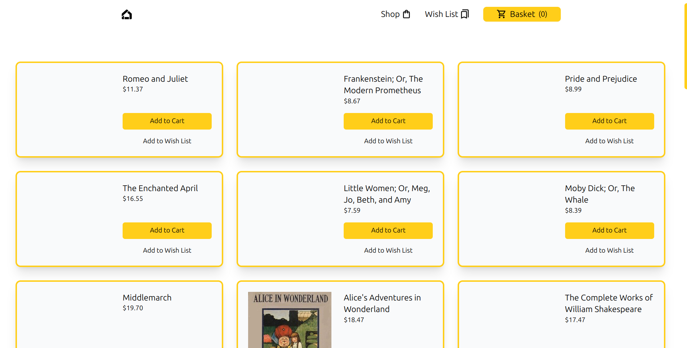
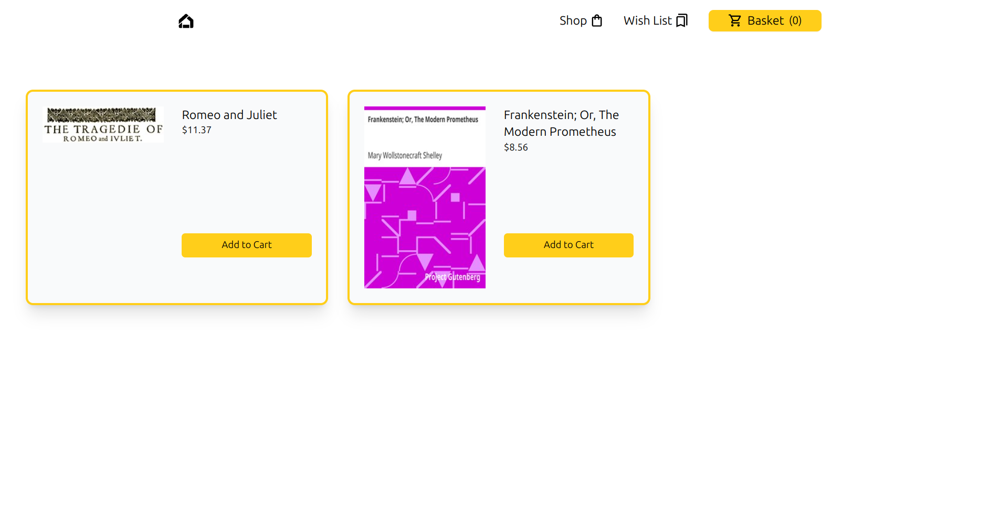
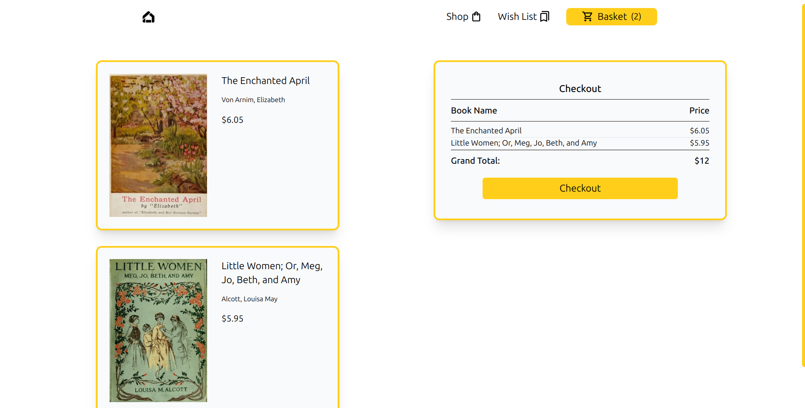

Welcome to your project! This README provides information on how to get started and perform common tasks.
## notes 

use only pnpm for this
## Getting Started

Follow these steps to get your project up and running:

1. Clone the repository:
   ```sh
   git clone https://github.com/a-s-t-e-y-a/infoB-J-P.git
   cd project-directory

2. To start the project:
   ```sh
   pnpm install 

3.  To start the server:
   ```sh
   pnpm dev
4. run server at:
   ```sh
   http://localhost:5173/


5. To commit using git bash script:
   ```sh
   chmod +x gitCommit.sh
    ./gitCommit.sh




