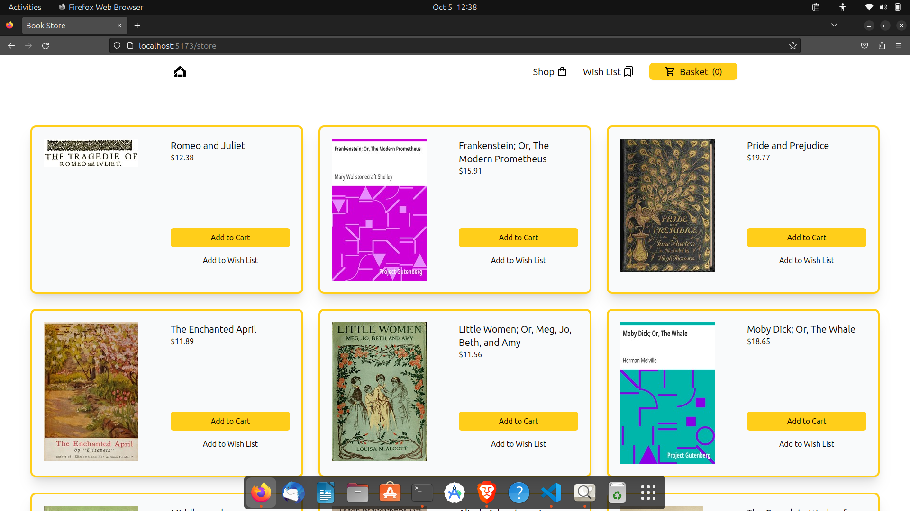

# Book Store

This is my submission of [TOP's Shopping Cart Project](https://www.theodinproject.com/lessons/node-path-react-new-shopping-cart).
,br
Made with [React](https://react.dev/) and [TailwindCSS](https://tailwindcss.com/). 

# Quickstart install
 

-fork repo

-git clone 

 install dependency

-pnpm intall

- start server using-
pnpm dev

# snapshot

